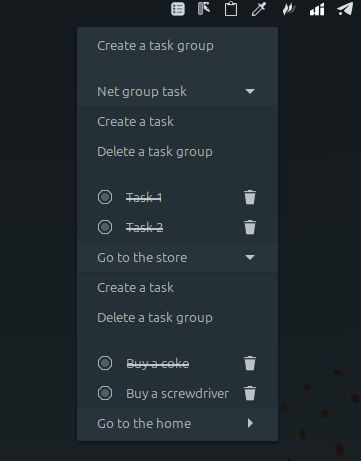

# TaskComplete

TaskComplete is a powerful task management tool integrated into the Cinnamon Workspace panel. It allows you to create task groups, add tasks to each group, and mark them as completed or deleted. A dialog to confirm deletion of groups is provided to prevent accidental actions.

# Features

- Creating task groups.
- Adding tasks to groups.
- Marking tasks as completed.
- Deleting tasks.
- Deleting task groups with confirmation.

# Installation

- Download TaskComplete.
- Extract the archive (if required) to the `~/.local/share/cinnamon/applets/` directory.
- In the Cinnamon desktop environment settings, go to the Applets section and add TaskComplete to the panel.

# Usage

1. Click the TaskComplete icon in the panel to open the main menu.
2. Click `Create a task Group`, enter a name for the group, and confirm.
3. In the created group, click `Create a task`, enter the task text, and confirm.
4. Mark tasks as completed using the complete button, or delete tasks as needed.
5. To delete a task group, use the `Delete a task group` button, confirming the action in the dialog box.

# Screenshots

# Feedback

If you have suggestions or have found a bug, please create an issue in the repository or contact the author via the Cinnamon applet store.